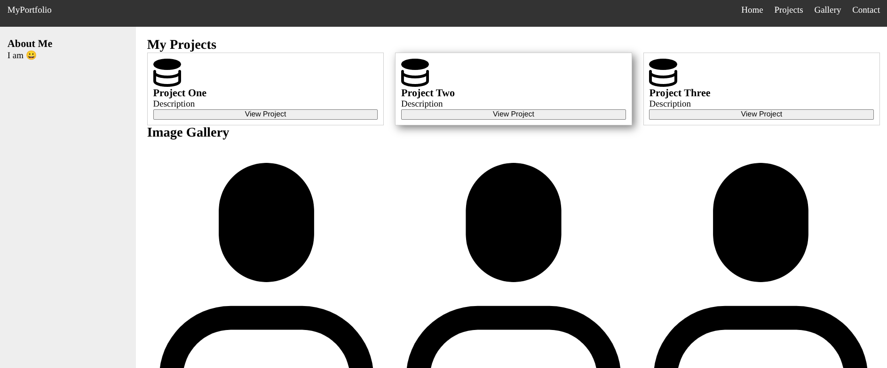
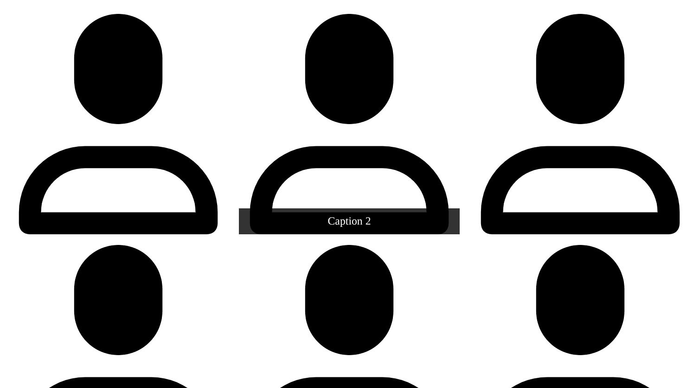

### Student: Zhumatayev Diyar
### Group: SE-2517

--- 

## URL:

<p>Site:     <a href = "https://savexanthous.github.io/Assignment-1/">https://savexanthous.github.io/Assignment-1/</a></p>
<p>Git Hub:  <a href = "https://github.com/SaveXanthous/Assignment-1">https://github.com/SaveXanthous/Assignment-1</a></p>

---

## 0

header with list links

```html
<header class="header-area">
    <div class="logo">MyPortfolio</div>
    <nav>
        <ul>
            <li><a href="#">Home</a></li>
            <li><a href="#projects">Projects</a></li>
            <li><a href="#gallery">Gallery</a></li>
            <li><a href="#">Contact</a></li>
        </ul>
    </nav>
</header>
```

```css
.header-area {
    display: flex;
    justify-content: space-between;
    align-items: center;
    padding: 20px;
}

.header-area ul {
    display: flex;
    gap: 20px; 
    list-style: none; 
}
```


## 1

Cards with buttion title img and discription

```html
<section id="projects" class="section">
    <h2>My Projects</h2>
    <div class="cards-container">
        <div class="card">
            
            <h3>Project One</h3>
            <p>Description</p>
            <button>View Project</button>
        </div>

        <div class="card">
            
            <h3>Project Two</h3>
            <p>Description</p>
            <button>View Project</button>
        </div>

        <div class="card">
            
            <h3>Project Three</h3>
            <p>Description</p>
            <button>View Project</button>
        </div>
    </div>
</section>
```

```css
.cards-container {
    display: flex;
    gap: 20px;
}

.card {
    display: flex;
    flex-direction: column; 
    flex: 1;
    border: 1px solid #ccc;
    padding: 10px;
}

.card img{
    width: 50px;
    height: 50px;
}

.card:hover {
    box-shadow: 5px 5px 15px gray;
}

.card button {
    margin-top: auto;
}
```


## 2

Grid


```css
.container {
    display: grid;
    grid-template-columns: 250px 1fr; 
    grid-template-rows: auto 1fr auto; 
    
    grid-template-areas: 
        "header header"
        "sidebar main"  
        "footer footer";  
    
    min-height: 100vh;
}

.header-area { grid-area: header; background: #333; color: white; }
.sidebar-area { grid-area: sidebar; background: #eee; padding: 20px; }
.main-area { grid-area: main; padding: 20px; }
.footer-area { grid-area: footer; background: #222; color: white; }
```



## 3

Gallery with title img

```html
<section id="gallery" class="section">
    <h2>Image Gallery</h2>
    <div class="gallery-container">
        <figure class="gallery-item"><figcaption>Caption 1</figcaption></figure>
        <figure class="gallery-item"><figcaption>Caption 2</figcaption></figure>
        <figure class="gallery-item"><figcaption>Caption 3</figcaption></figure>
        <figure class="gallery-item"><figcaption>Caption 4</figcaption></figure>
        <figure class="gallery-item"><figcaption>Caption 5</figcaption></figure>
        <figure class="gallery-item"><figcaption>Caption 6</figcaption></figure>
        <figure class="gallery-item"><figcaption>Caption 7</figcaption></figure>
        <figure class="gallery-item"><figcaption>Caption 8</figcaption></figure>
        <figure class="gallery-item"><figcaption>Caption 9</figcaption></figure>
    </div>
</section>
```

```css
.gallery-container {
    display: grid;
    grid-template-columns: repeat(3, 1fr); 
    gap: 15px;
    margin-top: 40px;
}

.gallery-item {
    position: relative;
}

.gallery-item img {
    width: 100%;
    display: block;
}

.gallery-item figcaption {
    display: none;
    position: absolute;
    bottom: 0;
    width: 100%;
    background: rgba(0, 0, 0, 0.8);
    color: white;
    text-align: center;
    padding: 10px;
}

.gallery-item:hover figcaption {
    display: block;
}
```


